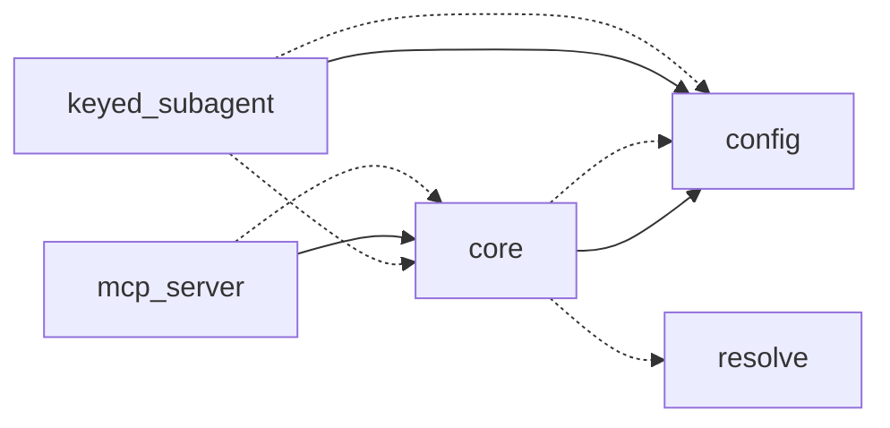

# Architecture diagram

Solid arrows are calls, dashed arrows are imports.

```mermaid
flowchart LR
    n0["config"]
    n1["core"]
    n2["keyed_subagent"]
    n3["mcp_server"]
    n4["resolve"]
    n1 --> n0
    n1 -.-> n0
    n1 -.-> n4
    n2 --> n0
    n2 -.-> n0
    n2 -.-> n1
    n3 --> n1
    n3 -.-> n1
```
